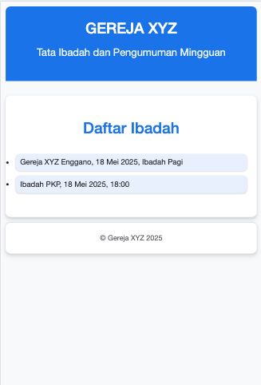
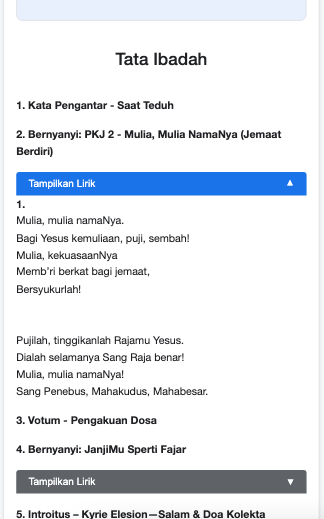
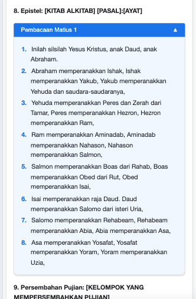
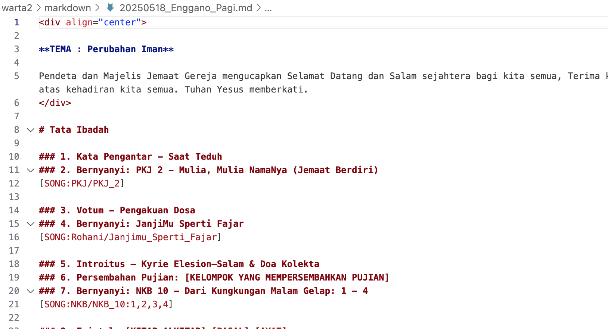

# Warta Online Gereja

Aplikasi web sederhana untuk menampilkan warta gereja, tata ibadah, dan pengumuman secara online menggunakan javascript dengan format penulisan markdown.

## Daftar Isi
- [Pendahuluan](#pendahuluan)
- [Struktur Folder](#struktur-folder)
- [Cara Penggunaan](#cara-penggunaan)
- [Membuat Warta Baru](#membuat-warta-baru)
- [Menjalankan di Komputer Lokal](#menjalankan-di-komputer-lokal)
- [Deploy ke Vercel](#deploy-ke-vercel)
- [Kustomisasi](#kustomisasi)
- [Lisensi](#lisensi)

## Pendahuluan

Warta Online Gereja adalah aplikasi web sederhana yang memungkinkan gereja mempublikasikan warta mingguan, tata ibadah, dan pengumuman gereja secara online. Aplikasi ini menggunakan format markdown yang mudah diedit dan tidak memerlukan database. Cocok untuk gereja dengan sumber daya teknis terbatas.

Fitur utama:
- Tampilan warta gereja yang responsif dan mudah dibaca
- Format teks dan lirik nyanyian dengan tombol tampil/sembunyikan
- Daftar warta otomatis tersusun berdasarkan tanggal
- Mudah diupdate tanpa perlu keahlian teknis yang tinggi

Demo aplikasi dapat dilihat di [tautan berikut ini](https://gkpibdl.mctm.web.id/).

## Struktur Folder

```
warta-online-pub/
├── css/                             # File CSS untuk tampilan website
├── js/                              # File JavaScript untuk fungsi website
│   └── app.js                       # Kode utama aplikasi
├── markdown/                        # Folder berisi file warta dalam format markdown
│   └── 20250518_siteNAME_Time.md    # Contoh file warta (dalam format YYYYMMDD.md)
│   └── bible/                       # Folder file alkitab
│   │ └── PB/                        # Perjanjian Baru
│   │ └── PL/                        # Perjanjian Lama
│   └─── songs/                      # Folder lirik lagu
│     └── KJ/                        # Kidung Jemaat
│     └── NKB/                       # Nyanyian Kidung Baru
│     └── PKJ/                       # Pelengkap Kidung Jemaat
│     └── Rohani/                    # Lagu Rohani Lainnya
├── scripts/                         # Script pendukung
│   └── update-markdown-list.js      # Script untuk memperbarui daftar warta
├── index.html                       # Halaman utama website
├── markdown-list.json               # Daftar file warta yang tersedia
└── readme.md                        # Dokumentasi (file ini)
```

## Cara Penggunaan

### Mulai dengan GitHub Repository

Cara termudah untuk memulai adalah dengan mengkloning repositori ini melalui terminal atau command line:

```
git clone https://github.com/username/warta-online-pub.git
cd warta-online-pub
```

Atau, Anda dapat mendownload sebagai ZIP dan mengekstraknya ke folder pilihan Anda.

### Membuat Warta Baru

1. **Buat file markdown baru** dengan format nama `YYYMMDD_siteNAME_Time.md` (tahun, bulan, tanggal) di folder `markdown/`. Misalnya:
   - `20250525_Enggano_Pagi.md` untuk warta tanggal 25 Mei 2025 di gereja Enggano untuk sesi Pagi.
   - `20250525_Melur_Sore.md` untuk warta tanggal 25 Mei 2025 di gereja Melur untuk sesi Sore.
   - `20250525_PKP_1800.md` untuk warta tanggal 25 Mei 2025 di kegiatan PKP untuk jam 18:00.
```
penamaan Enggano, Melur, Pagi, Sore, PKP, PKB, PKW, DLL bisa dilihat di js/app.js, di line 332 dan 528:
       const ibadahMingguMatch = filename.match(/^(\d{4})(\d{2})(\d{2})_(Enggano|Melur)_(Pagi|Sore)\.md$/);
       const kebaktianKelompokMatch = filename.match(/^(\d{4})(\d{2})(\d{2})_([a-zA-Z0-9]+)_(\d{4})\.md$/);
  
untuk custom order warta/tata ibadah di index html bisa diatur di js/app.js, line 301:
       const order = ['Enggano_Pagi', 'Enggano_Sore', 'Melur_Pagi', 'Melur_Sore', 'PKP', 'Kelompok']; 
```
2. **Salin template** dari file `20250518_Enggano_Pagi.md` yang sudah ada dan modifikasi sesuai kebutuhan.

3. **Isi bagian-bagian warta** dengan informasi yang sesuai:
   - Tema ibadah
   - Tata ibadah dan nyanyian
   - Pelayan ibadah
   - Statistik kehadiran
   - Pengumuman-pengumuman
   - Keuangan
```
    **Untuk format lagu dan bible :**
      Kidung Jemaat 1, semua ayat = [SONG:KJ/KJ_1]
      Kidung Jemaat 2, ayat 1 dan 3 = [SONG:KJ/KJ_2:1,3] bila ada reff nya, maka format = [SONG:KJ/KJ_2:1,Reff,3,Reff]
      (atau **ubah file lagu md sehingga tiap ayat memiliki reff nya sendiri2**), sehingga format = [SONG:KJ/KJ_2:1,3]
      Matius 1 ayat 10 = [BIBLE:PB/Matius_1:10]
      Kejadian 1 ayat 5 sampai 16 = [BIBLE:PL/Kejadian_1:5-16]
   **Pastikan ada line break (baris kosong) dibawah setiap format lagu/bible.**
```
5. **Update daftar warta** dengan menjalankan script `update-markdown-list.js`:
   ```
   node scripts/update-markdown-list.js
   ```
   Script ini akan memperbarui file `markdown-list.json` dengan daftar terbaru warta yang tersedia.

### Format Penulisan

File markdown mendukung format berikut:

- Gunakan `#` untuk judul utama, `##` untuk sub-judul, `###` untuk sub-sub-judul
- Gunakan tabel dengan format markdown standar untuk statistik, daftar jemaat, dan keuangan
- [baru] Kode nyanyian dan ayat alkitab menyesuaikan dengan kode yang dijelaskan diatas. pastikan ada line break / spasi kosong dibawah lagu agar format dokumen tidak rusak

### Menjalankan di Komputer Lokal

Untuk melihat hasilnya sebelum dipublikasikan:

1. **Gunakan server web sederhana**. Jika Anda memiliki Node.js, bisa menggunakan:
   ```
   npx serve
   ```
   atau jika menggunakan Python:
   ```
   python -m http.server
   ```

2. **Buka browser** dan akses `http://localhost:5000` (untuk `serve`) atau `http://localhost:8000` (untuk Python).

## Deploy ke Vercel

Vercel adalah layanan hosting gratis yang cocok untuk website statis seperti ini:

1. **Buat akun di [Vercel](https://vercel.com)** jika belum memiliki.

2. **Upload project ke GitHub**:
   - Buat repository baru di GitHub
   - Upload project ke repository tersebut
   ```
   git init
   git add .
   git commit -m "Initial commit"
   git branch -M main
   git remote add origin https://github.com/username/warta-online-pub.git
   git push -u origin main
   ```

3. **Deploy di Vercel**:
   - Login ke akun Vercel
   - Klik "New Project"
   - Pilih repository GitHub yang telah dibuat
   - Klik "Deploy"
   - Setelah proses deploy selesai, website akan tersedia di URL yang disediakan Vercel

4. **Setiap kali update**:
   - Edit file warta atau tambah warta baru
   - Jalankan script update daftar warta
   - Push ke GitHub
   ```
   git add .
   git commit -m "Update warta tanggal xxx"
   git push
   ```
   - Vercel akan otomatis memperbarui website Anda

## Kustomisasi

### Mengubah Nama Gereja dan Tampilan

1. Edit file `index.html` untuk mengubah nama gereja dan informasi umum
2. Edit file CSS di folder `css/` untuk mengubah warna, font, dan tampilan lainnya

### Mengubah Template Warta

Sesuaikan file template warta sesuai kebutuhan gereja Anda, dengan mengubah:
- Bagian-bagian tata ibadah
- Format pengumuman
- Struktur laporan keuangan

## Lisensi

Dibuat oleh Martin Manullang. Bebas digunakan dan dimodifikasi untuk keperluan gereja.
Fork oleh Yopianus Linga / @slickers untuk penambahan fitur dan tampilan.

- Web / Mobile View


- Lirik


- Alkitab


- Kode

